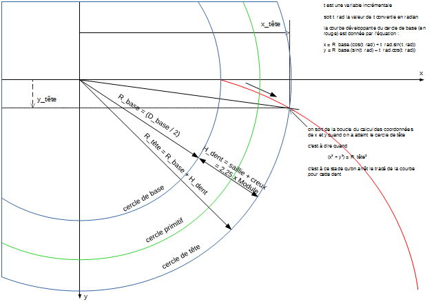
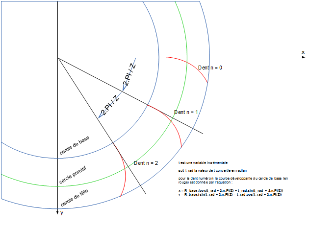
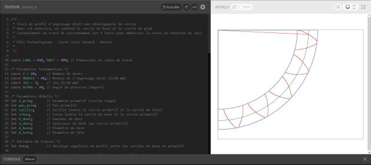

# trace-engrenage-droit

## Introduction

On se propose de réaliser, à l'aide des fonctions graphiques de la bibliothèque P5.js, la conception et la visualisation de profils d'engrenages droits classiques, dits en "développante de cercle".

[L'article de Wikipédia sur ce sujet](https://fr.wikipedia.org/wiki/Développante_du_cercle) est une bonne introduction.

Pour aller un peu plus loin, voir cet article sur [Zpag](http://www.zpag.net/Machines_Simples/engrenage_droit_dent_droit.htm).

Les notions de base relatives aux engrenages sont (indispensable pour utiliser un progiciel de CAO dans ses fonctions de modélisation automatique) :

- rapport, nombre de dents
- module
- jeu
- angle de pression
- cercle de pied
- cercle de base
- cercle primitif
- cercle de tête
- pas primitif
- pas de base
- creux
- saillie
- épaisseur de dent

Pour ce tracé de profil d'engrenage droit par développante de cercle, on confond le cercle de base et le cercle de pied
(normalement un tracé de raccordement est à faire pour abaisser le creux en fonction du jeu).

## Tracé de la développante de cercle du profil de la première dent

Pour le cercle de base centré en l'origine et de rayon R_base, la développante issue du point M(0) placé sur ce cercle de base à l'angle de départ 0, peut être paramétrée pour tout point M(t) de cette développante, en calculant ses coordonnées cartésiennes à partir de l'angle t :

`x(t)=R_base.(cos (t) + t.sin (t))`

`y(t)=R_base.(sin (t) - t.cos (t))`

où l'angle t entre OM(0) et OM(t) est exprimé en radians.

## Réitération du tracé élémentaire pour plusieurs dents

Il s'agit d'appeler autant de fois la fonction de tracé qu'il y a de dents sur le quart de cercle affiché, en généralisant l'équation de développante de cercle à une dent quelconque.

Pour cela, on déduit de l'équation de base que pour la n-ième dent dont le profil démarre donc à l'angle n( 2.PI / Z) sur le cercle de base, l'équation de la courbe est définie par :

`xn(t)=R_base.(cos (t + 2.n.PI/Z) + t.sin (t + 2.n.PI/Z))`

`yn(t)=R_base.(sin (t + 2.n.PI/Z) - t.cos (t + 2.n.PI/Z))`

où l'angle t entre OM(0) et OM(t) est exprimé en radians.

## Calcul du décalage angulaire entre les points de départ des 2 profils opposés d'une même dent

Au cercle primitif (en vert), l'épaisseur de la dent est donnée par le pas primitif moins le jeu. Il reste à trouver l'angle entre le pied de la dent et le point du profil situé au cercle primitif. Il s'agit de l'angle entre l'horizontale et le rayon rouge tracé sur la capture d'écran ci-dessous. Plutôt que de le calculer, il est facile de l'obtenir par programmation, lors du tracé du premier profil de la première dent.

C'est la valeur de l'angle entre le pied de la dent et le point (x, y) situé sur le cercle primitif :

`x2 + y2 = (d_prim/2)2`( en vertu du théorème de Pythagore).

Appelons cet angle teta. Il doit être mémorisé afin de pouvoir refaire la totalité des tracés pour les profils opposés.

Comme on est sur la première dent :

`teta = artan(y/x)`

Deux choses changent par rapport aux tracés directs déjà effectués :

- la valeur de départ de t, pour cette deuxième passe n'est plus 0 mais '[2.teta + (pas_prim - JEU)/d_prim]'

- l'équation de la développante des profils opposés devient :

`xn(t)=R_base.(cos (-t + 2.n.PI/Z) - t.sin (-t + 2.n.PI/Z))`

`yn(t)=R_base.(sin (-t + 2.n.PI/Z) + t.cos (-t + 2.n.PI/Z))`

en raison du changement de signe dans la progression de l'angle t (régression).

